# Разработка модуля с интегрированной системой захвата движений в реальном времени

Модуль для программно-аппаратного комплекса по реабилитации и анализу пациентов с нарушениями опорно-двигательного аппарата (нижние конечности).

## Цель
Разработать модуль с интегрированной системой захвата движений в реальном времени для программно-аппаратного комплекса по реабилитации и анализа пациентов с нарушениями опорно-двигательного аппарата с возможностью унификации, объективизации и пролонгации процесса физической реабилитации.

## Задачи
- Разработка модуля захвата движения на беговой дорожке в двух проекциях  
- Проработка аппаратной части захвата движения  
- Разработка диагностического модуля по захвату движения  
- Тестирование системы на базовых упражнениях по реабилитации нижних конечностей  

## Используемые инструменты
**Аппаратная часть:**
- Камеры  
- Беговая дорожка  
- Персональный компьютер  

**Программная часть:**
- Отслеживание скелета человека – MediaPipe  
- Основная архитектура: Python, OpenCV, NumPy, Matplotlib  

## Область применения
Результаты могут быть использованы для реабилитации пациентов с нарушением работы опорно-двигательного аппарата (нижние конечности). Комплекс может быть внедрён в любом медицинском учреждении.

---

## Теория: Гибкость голеностопа
Подошвенное сгибание измеряется при положении пациента сидя со свешенными ногами, лёжа на спине или стоя на одной ноге. Движение выполняется в голеностопном суставе. Коленный сустав согнут на 90°, стопа в положении 0°.

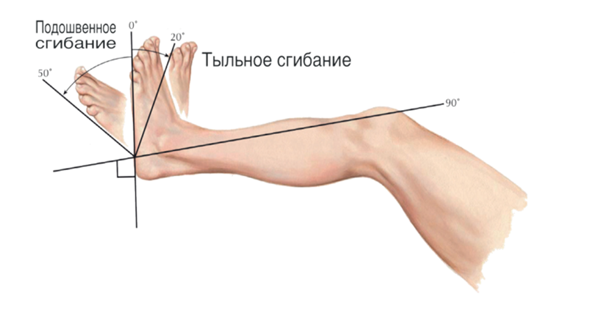
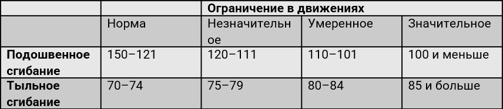

---

## Теория: Биомеханика при беге
При беге колено сгибается примерно до 40° в момент удара пяткой, затем сгибается до 60° во время переноса.  
После этого колено начинает разгибаться и достигает 40° сгибания непосредственно перед отталкиванием носком.  
Во время фазы переноса конечности и начала периода полёта колено сгибается, достигая максимального сгибания в 125° в середине фазы переноса.

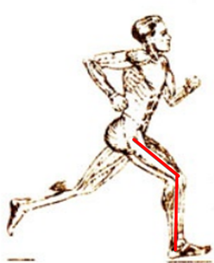
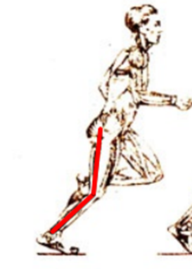
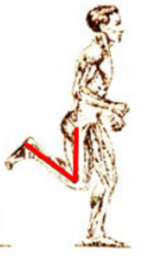

---

## Теория: Присед
При выполнении приседа коленный сустав в рабочей амплитуде достигает угла сгибания в 90°. Если максимальный угол меньше — недостаточная гибкость коленного сустава.

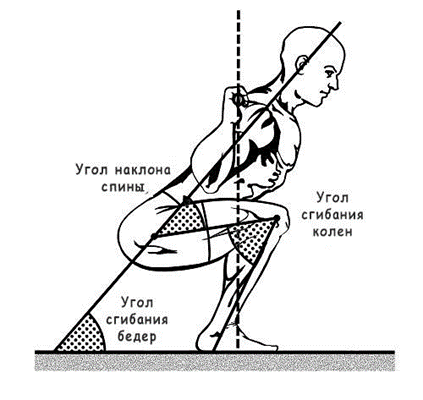
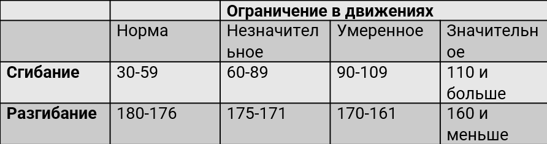

---

## Демонстрация работы: Присед
Средние углы при приседаниях:  
- Левая нога: 96°  
- Правая нога: 97°  

Количество полных приседаний:  
- Левая нога: 19  
- Правая нога: 19  
- Всего: 19  

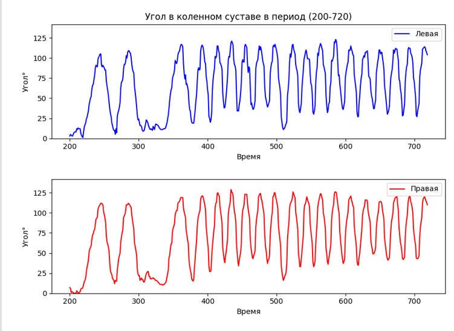
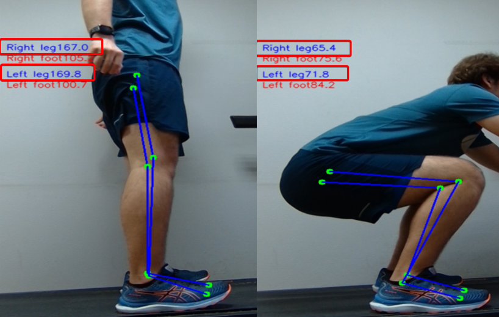

---

## Демонстрация: Гибкость голеностопа
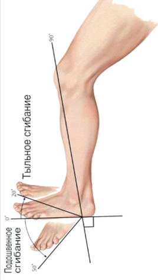
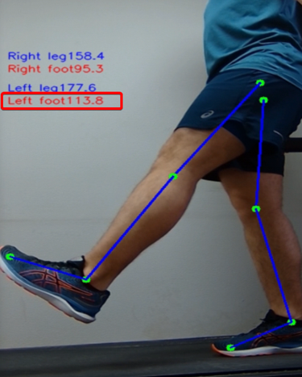
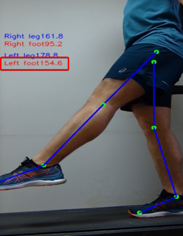

---

## Ходьба
Анализ левой ноги:  
- Максимальный угол: 82°  
- Минимальный угол: 0°  

Анализ правой ноги:  
- Максимальный угол: 86°  
- Минимальный угол: 0°  

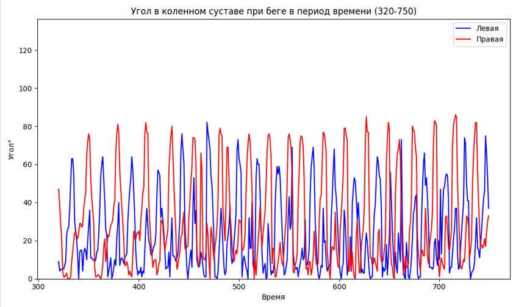
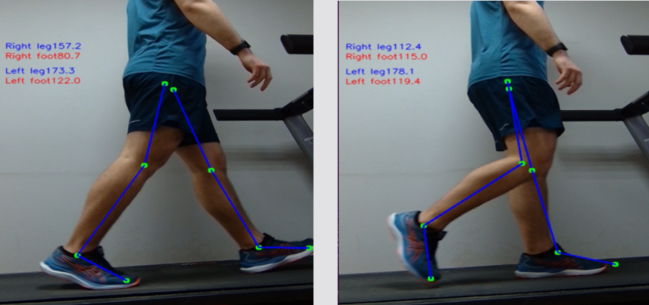

---

## Бег в высоком темпе
Анализ левой ноги:  
- Максимальный угол: 111°  
- Минимальный угол: 2°  

Анализ правой ноги:  
- Максимальный угол: 124°  
- Минимальный угол: 1°  

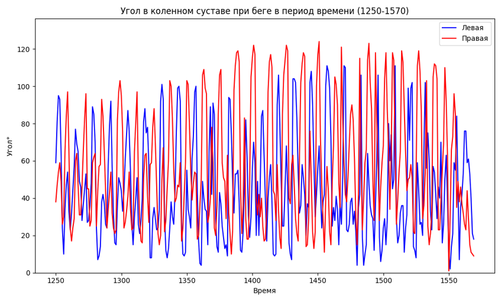
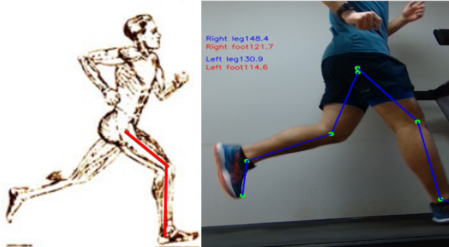
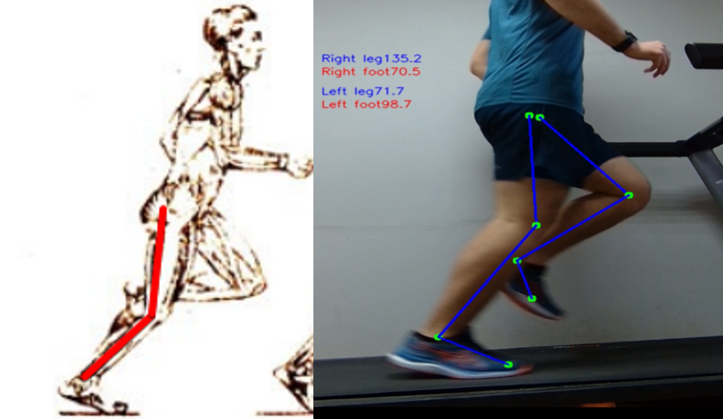

---

## Заключение
- Разработан модуль захвата движения на беговой дорожке в двух проекциях  
- Проработана аппаратная часть захвата движения  
- Разработан диагностический модуль по захвату движения  
- Проведено тестирование системы на базовых упражнениях по реабилитации нижних конечностей  